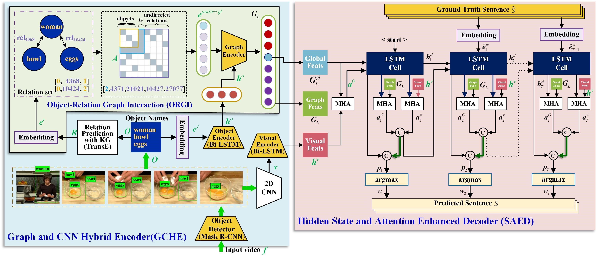

# Fully-Exploring-Object-Relation-Interaction-and-Hidden-State-Attention-for-Video-Captioning

Knowledge Graph (KG) can predict the relationships between objects.
Since a video's description is typically composed of the objects present and the relationships between them, accurately identifying multiple objects and effectively modeling their interactions is essential. To address this, we integrated KGs into the field of video captioning (VC) to enhance relationship modeling and improve descriptive accuracy.

We evaluate our model on three main datasets: MSVD, MSR-VTT, VaTex




## Prepare

**1. Create python environment (optional) <br>**
conda create -n kgvcn python=3.8 <br>
source activate kgvcn <br>

**2. Install python dependencies <br>**
pip install -r requirements.txt <br>

**3. Download captioneval [here](https://pan.baidu.com/s/1QX9RpCyX-J31XZyZH2uHlw?pwd=qwer) <br>**

**4. Download Datasets: [MSVD](https://pan.baidu.com/s/1QX9RpCyX-J31XZyZH2uHlw?pwd=qwer) <br>**,
[MSR-VTT](https://pan.baidu.com/s/1QX9RpCyX-J31XZyZH2uHlw?pwd=qwer) <br>**,
[vatex](https://pan.baidu.com/s/1QX9RpCyX-J31XZyZH2uHlw?pwd=qwer) <br>**

## model structure
```bash
# datasets' features, and annotations
./captioneval
./models
./results
./runs
./utils
./data
    MSR-VTT/
    MSVD/
    vatex/
        VATEX/
        VATEX_ordered_feature/
        vatex_test_references.txt/
```

## Traning
you can train this model directly run this file: train_debug.py

## Acknowledgement

This repo is adapted from [DLSG](https://github.com/baiyang4/D-LSG-Video-Caption). Thank for their work!


## Reference

Please cite our paper if you use our models in your project.

```bibtex
@article{yuan2025fully,
  title={Fully exploring object relation interaction and hidden state attention for video captioning},
  author={Yuan, Feiniu and Gu, Sipei and Zhang, Xiangfen and Fang, Zhijun},
  journal={Pattern Recognition},
  volume={159},
  pages={111138},
  year={2025},
  publisher={Elsevier}
}
```
